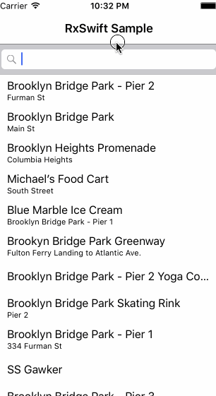

# RollingProgressHUD

Rolling progress HUD for your iOS.




## Installation

RollingProgressHUD is available through [CocoaPods](http://cocoapods.org). To install
it, simply add the following line to your Podfile:

```ruby
pod "RollingProgressHUD"
```

## Usage

Import RollingProgressHUD.

```
import RollingProgressHUD
```

### Showing the HUD

```
RollingProgressHUD.show()
```

### Dismissing the HUD

```
RollingProgressHUD.dismiss()
```

## Requirements

Swift 3.0 / iOS 8.0+

## Creator

[Kosuke Ogawa](https://twitter.com/koogawa)
 
## License

RollingProgressHUD is available under the MIT license. See the LICENSE file for more info.


 
